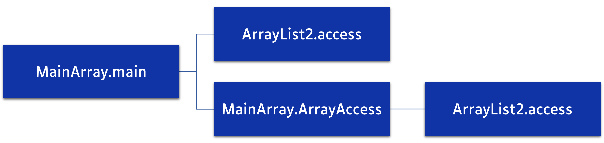

# How Joular Code for Java Works

Joular Code for Java is a Java agent that hooks to the Java Virtual Machine (JVM) on startup along with the monitored application (or attaches to it later).
It runs in a separate thread and collects information about CPU usage of the JVM process, each thread running in the JVM, and then for each method and execution branch of the application.

Joular Code for Java is the successor of [JoularJX](https://github.com/joular/joularjx), itself the successor of [Jalen](https://www.noureddine.org/research/jalen), and the core approach of statistical sampling is based on and inspired by the work we did in monitoring energy hotspots in software ([ASE 2012 conference paper](https://hal.inria.fr/hal-00715331/document), and [ASE Journal paper in 2015](https://hal.inria.fr/hal-01069142/document)).

## The monitoring process

The monitoring process is as follows, every monitoring cycle (about 1 second):

1. Every `stack-monitoring-sample-rate` milliseconds (by default, 10 milliseconds), Joular Code for Java captures the stack trace of every `RUNNABLE` thread, counting how often each execution branch is seen.
2. At the start and the end of each cycle, it reads the CPU time of each thread and of the whole JVM, using the JDK's `ThreadMXBean` and `OperatingSystemMXBean`.
3. It reads the CPU power of the machine over the cycle, from RAPL, PowerJoular, or the host of a virtual machine (see [Power Sources](./power_sources.md)).
4. It calculates the power of the JVM: the JVM's share of the CPU power is its own CPU load over the machine's.
5. It attributes the power to methods and execution branches: each thread receives a part of the JVM's power proportional to its CPU time. Within each thread, the power is then distributed to its execution branches, proportionally to how often each was seen in the stack samples.
6. It writes the results to the CSV files: both the power (W) and the energy (J = W × cycle duration) of each branch for that cycle.

In short:

```
JVM power      = CPU power × JVM CPU load / machine CPU load
thread power   = JVM power × thread CPU time / CPU time of all the JVM's threads
branch power   = thread power × samples of the branch in the thread / samples of the thread
```

A branch seen on several threads (for example, the workers of a thread pool running the same code) gets the sum of its power on each of them.
The JVM's share is never more than the whole CPU power, and when the machine's CPU load is unknown, the JVM's own load is used instead.

Threads are weighted by their CPU time rather than by their number of samples, so a thread blocked in native I/O (which Java still reports as `RUNNABLE`) is not charged for waiting.

The JVM's own native threads (garbage collector, JIT compiler) are part of the JVM's power, but not of any Java thread's CPU time, so their share is spread over the Java threads in proportion to their own CPU time.

The agent's own monitoring thread is left out: it is not sampled, and its CPU time is taken out of the JVM's.

## Execution branches

During the monitoring cycles, Joular Code for Java does not only identify the method being executed (the method on top of the stack trace), but also its execution branch (all the methods calling it), and provides the power and energy of each execution branch, as seen in the following figure:



Usually the method on the top of the stack trace is a method from the JDK.
For example, calling `System.out.println()` from the application's method `Main` will call other methods from the JDK (such as buffers, writeln, etc.).
Joular Code for Java checks, in the stack trace, which methods of the branch belong to the application we wish to monitor (with the `methods-filtering-prefix` setting), and thus allocates to them the power of the methods they call that are not part of the application (the JDK's, libraries, frameworks), in the filtered file (see [Generated Files](./generated_files.md)).

Two stack traces are the same branch when they go through the same methods, whatever the line numbers.

## Timing of the cycles

The length of a cycle depends on the power source:

- With RAPL, a cycle lasts one second (until the first stack sample after one second, so a little more with a large `stack-monitoring-sample-rate`), and the energy is read at its very end, so the power and the stack samples cover the same time.
- With the PowerJoular ring buffer, a cycle ends when PowerJoular publishes a measurement, or after two seconds without one, in which case that cycle gets no rows. While there is no ring buffer to read yet, cycles last one second and get no rows.
- In a virtual machine, a cycle lasts one second too, like with RAPL, and gets the latest power the host wrote.

Each cycle starts where the previous one ended, so no time is lost while the results are written.

## Limits

Sampling the stacks of the JVM's threads cannot see:

- Threads that end during a cycle, even ones started before it, as the JVM no longer reports their CPU time once they have ended. Their power is spread over the threads still alive, like the garbage collector's, and `coverage` does not show it.
- Virtual threads, which are not in the thread dumps Joular Code for Java takes.
- Whether a sampled thread was actually running on a CPU at that instant.

The `coverage` column of the generated files says how much of the CPU time of the JVM's threads was accounted for in each cycle.

When the stacks cannot be sampled as often as asked (with many threads, and a very low `stack-monitoring-sample-rate`), Joular Code for Java shows a warning: set a higher `stack-monitoring-sample-rate`, or accept coarser data.