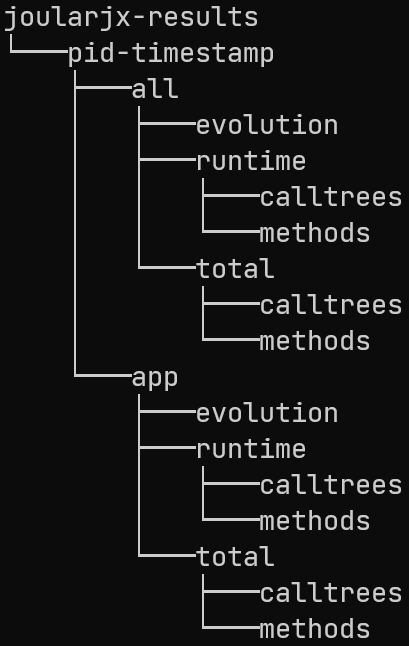

# Generated Files

JoularJX will generate multiple CSV files according to the configuration settings (in ```config.properties```), and will create these files in a ```joularjx-results```folder.

The generated files are available under the following folder structure:
- joularjx-results
  - appName-PID-start_timestamp
    - all (power/energy data for all methods, including the JDK ones)
      - runtime (power consumption every second)
        - calltree (consumption for each call tree branch)
        - methods (consumption for each methods)
      - total (total energy consumption, generated at the program's end)
        - calltree
        - methods
      - evolution (power consumption evolution of every method, throughout the execution of the application)
    - app (power/energy data for methods of the monitored application, according to the ```filter-method-names``` setting)
      - runtime
        - calltree
        - methods
      - total
        - calltree
        - methods
      - evolution

The folder structure is summarized in the following figure:



For real-time power data or the total energy at the program exit, JoularJX generated two CSV files:

- A file which contains power or energy data for all methods, which include the JDK's ones.
- A *filtered file* which only includes the power or energy data of those filtered methods (can be configured in ```config.properties```). This data is not just a subset of the first data file, but rather a recalculation done by JoularJX to provide accurate data: methods that start with the filtered keyword, will be allocated the power or energy consumed by the JDK methods that it calls.

For example, if ```Package1.MethodA``` calls ```java.io.PrintStream.println``` to print some text to a terminal, then we calculate:

- In the first file, the power or energy consumed by ```println``` separately from ```MethodA```. The latter power consumption won't include those consumed by ```println```.
- In the second file, if we filter methods from ```Package1```, then the power consumption of ```println``` will be added to ```MethodA``` power consumption, and the file will only provide power or energy of ```Package1``` methods.

We manage to do this by analyzing the stacktrace of all running threads on runtime.