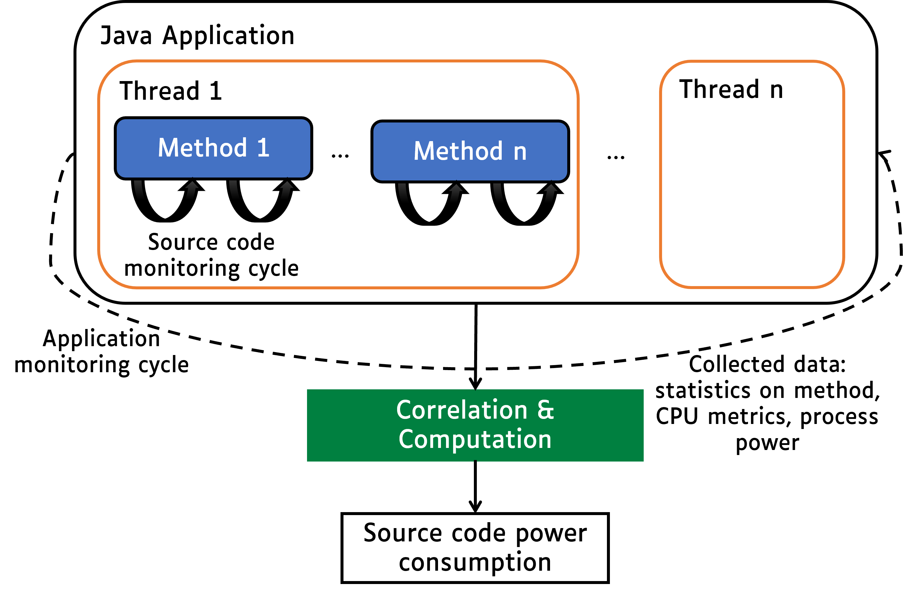
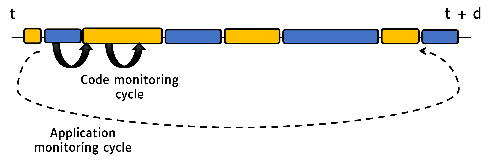
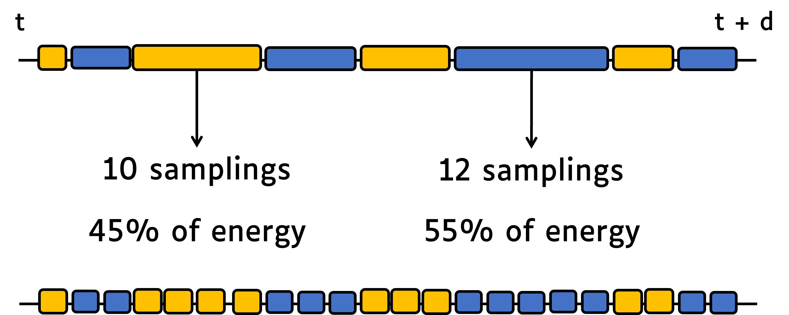
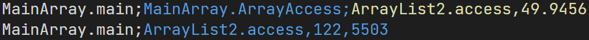
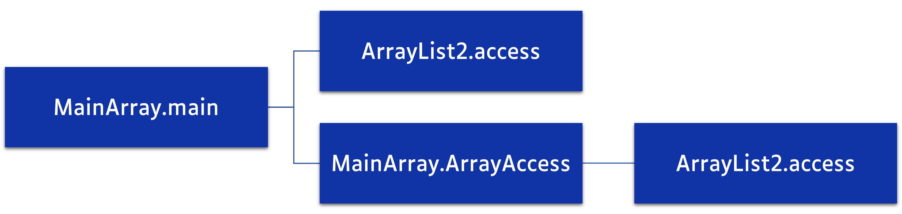
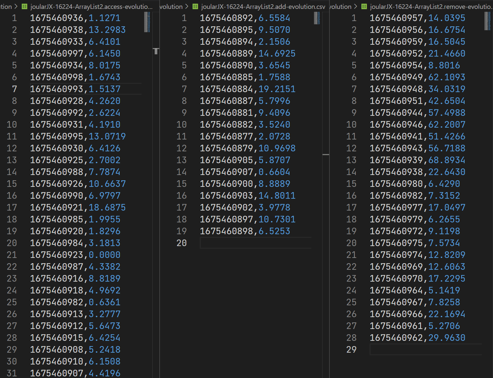

# How JoularJX Works

JoularJX is a Java agent that hooks to the Java Virtual Machine (JVM) on startup along with the monitored application.
It runs in a separate thread and collects information about CPU usage of the JVM process, each thread running in the JVM, and then for each method of the application.

[JoularJX](https://www.noureddine.org/research/joular/joularjx) is the successor of [Jalen](https://www.noureddine.org/research/jalen), and the core approach of statistical sampling is based and inspired by the work we did in monitoring energy hotspots in software ([ASE 2012 conference paper](https://hal.inria.fr/hal-00715331/document), and [ASE Journal paper in 2015](https://hal.inria.fr/hal-01069142/document)).
JoularJX version 1 is described in our newer research paper at the [IE 2022 conference](https://hal.science/hal-03608223v1/document).

The general architecture of JoularJX is summarized in the following figure:



The monitoring process is as follows:

- Every application monitoring cycle (by default, 1 second), JoularJX collects the CPU usage of the JVM and calculates the power consumption of the entire JVM (on Windows, using the PowerMonitor.exe program using Intel API, on x86_64 Linux using RAPL interface in the Linux kernel, and on Raspberry Pi and Asus Tinker Board using our regression power models).
- Then, JoularJX collects the CPU usage of each thread in the JVM using the JDK's ```getThreadCpuTime``` method, and calculates the power consumption of each thread.
- Every source code monitoring cycle (by default, 10 milliseconds), JoularJX checks, for each thread, the stacktrace and identify the method being executed (the method on top of the stacktrace). At the end of the application monitoring cycle, JoularJX statistically analyzes the ratio of each method observed in the stacktrace, and allocate the power consumption accordingly as seen in the following figures:





Usually the method on the top of the stacktrace is a method from the JDK.
For example, calling ```System.out.println()``` from the application's method ```Main``` will call other methods from the JDK (such as buffers, writeln, etc.).
JoularJX will verify, when checking the stacktrace, if the method is called, anywhere in its call tree, by a method from the application we wish to monitor, and thus isolate these statistics from methods called by other applications or by the JoularJX agent itself.

During these monitoring cycles, JoularJX not only identify the method being executed, but also its execution branch (all the methods calling it), and can provide power and energy consumption for each execution branch as seen in the following figures:





JoularJX will also automatically calculate the power consumption for each method, for each timestamp, thus allowing to trace the power consumption evolution of each method, as seen in the following figure:

